# 智能定价系统调用关系图

## 从 main.py 入口开始的完整调用关系

```mermaid
graph TB
    Start([main.py: main函数]) --> LoadData{数据文件存在?}
    LoadData -->|是| LoadFiles[load_data_files]
    LoadData -->|否| CreateSample[create_sample_data]
    
    LoadFiles --> InitSystem[系统初始化]
    CreateSample --> InitSystem
    
    InitSystem --> ConfigMgr[ConfigManager]
    ConfigMgr --> CreateGenerator[EnhancedPricingStrategyGenerator.__init__]
    
    CreateGenerator --> CreateDataProc[TransactionDataProcessor]
    CreateGenerator --> CreateFeatureEng[PricingFeatureEngineer]
    CreateGenerator --> CreateDemandPred[EnhancedDemandPredictor]
    CreateGenerator --> CreateVisualizer[SimplifiedModelVisualizer]
    
    InitSystem --> GenerateStrategy[strategy_generator.generate_pricing_strategy]
    
    GenerateStrategy --> GetProductInfo[_get_product_info]
    GetProductInfo --> FilterProduct[data_processor.filter_by_product]
    GetProductInfo --> GetProductSummary[data_processor.get_product_summary]
    GetProductInfo --> EstimateCost[_estimate_cost_price]
    GetProductInfo --> IsFresh[_is_fresh_product]
    GetProductInfo --> EstimateShelfLife[_estimate_shelf_life]
    
    GenerateStrategy --> PrepareFeatures[_prepare_features]
    PrepareFeatures --> CreateFeatures[feature_engineer.create_features]
    CreateFeatures --> FilterStoreProducts[feature_engineer._filter_store_products]
    CreateFeatures --> CreateBaseFeatures[feature_engineer._create_base_features]
    CreateFeatures --> ExtractHistorical[feature_engineer._extract_historical_features]
    CreateFeatures --> ExtractPrice[feature_engineer._extract_price_features]
    CreateFeatures --> ExtractWeather[feature_engineer._extract_weather_features]
    CreateFeatures --> ExtractCalendar[feature_engineer._extract_calendar_features]
    CreateFeatures --> ExtractProduct[feature_engineer._extract_product_features]
    
    PrepareFeatures --> GetProductSummary2[data_processor.get_product_summary]
    PrepareFeatures --> ExtractStoreFeatures[_extract_store_features]
    
    GenerateStrategy --> TrainPredictor[_train_demand_predictor]
    TrainPredictor --> PrepareTrainingData[demand_predictor.prepare_training_data_from_transactions]
    PrepareTrainingData --> FilterByProduct2[data_processor.filter_by_product]
    PrepareTrainingData --> GetProductSummary3[data_processor.get_product_summary]
    
    TrainPredictor --> TrainModel[demand_predictor.train]
    TrainModel --> CreateProductInfo[ProductInfo]
    
    TrainPredictor --> PredictTrainSet[demand_predictor.predict_train_set]
    TrainPredictor --> CalcMetrics[_calculate_performance_metrics]
    CalcMetrics --> MAE[mean_absolute_error]
    CalcMetrics --> MSE[mean_squared_error]
    CalcMetrics --> R2Score[r2_score]
    
    TrainPredictor --> CreateEvalResult[ModelEvaluationResult]
    TrainPredictor --> CreateReport[visualizer.create_comprehensive_report]
    
    GenerateStrategy --> CreateOptimizer[PricingOptimizer.__init__]
    GenerateStrategy --> OptimizePricing[pricing_optimizer.optimize_staged_pricing]
    
    OptimizePricing --> DPOptimization[pricing_optimizer._dynamic_programming_optimization]
    DPOptimization --> PredictDemand[demand_predictor.predict_demand]
    PredictDemand --> CreateFeatureVector[demand_predictor._create_complete_feature_vector]
    PredictDemand --> AdvancedHeuristic[demand_predictor._advanced_heuristic_prediction]
    
    GenerateStrategy --> EvaluateSchedule[pricing_optimizer.evaluate_pricing_schedule]
    EvaluateSchedule --> GenerateRecommendation[pricing_optimizer._generate_recommendation]
    
    GenerateStrategy --> CalcConfidence[_calculate_confidence_score]
    
    GenerateStrategy --> GenerateStrategyID[_generate_strategy_id]
    
    GenerateStrategy --> GenerateViz[visualizer._generate_strategy_visualizations_with_pil]
    
    GenerateStrategy --> CreateStrategy[EnhancedPricingStrategy]
    
    Start --> SaveStrategy{保存策略?}
    SaveStrategy -->|是| SaveToFile[strategy_generator.save_strategy]
    SaveToFile --> ToJSON[strategy.to_json]
    SaveToFile --> ToDict[strategy.to_dict]
    
    Start --> ExportPlan{导出计划?}
    ExportPlan -->|是| CreateExecutionPlan[创建执行计划DataFrame]
    
    style Start fill:#e1f5ff
    style GenerateStrategy fill:#fff4e1
    style TrainPredictor fill:#ffe1f5
    style OptimizePricing fill:#e1ffe1
    style CreateStrategy fill:#f5e1ff
```



## 主要模块说明

### 1. 入口模块 (main.py)
- **main()**: 主函数，程序入口
- **load_data_files()**: 加载CSV数据文件
- **create_sample_data()**: 创建示例数据

### 2. 核心模块 (core/)
- **EnhancedPricingStrategyGenerator**: 定价策略生成器主类
  - `generate_pricing_strategy()`: 生成定价策略的主方法
  - `_train_demand_predictor()`: 训练需求预测模型
  - `_prepare_features()`: 准备特征数据
  - `_get_product_info()`: 获取商品信息
  - `_calculate_confidence_score()`: 计算置信度
  - `_extract_store_features()`: 提取门店特征

### 3. 数据处理模块 (data/)
- **TransactionDataProcessor**: 交易数据处理器
  - `filter_by_product()`: 按商品筛选数据
  - `get_product_summary()`: 获取商品汇总信息
  - `_preprocess_data()`: 数据预处理

- **PricingFeatureEngineer**: 特征工程器
  - `create_features()`: 创建特征
  - `_extract_historical_features()`: 提取历史特征
  - `_extract_price_features()`: 提取价格特征
  - `_extract_weather_features()`: 提取天气特征
  - `_extract_calendar_features()`: 提取日历特征

### 4. 模型模块 (models/)
- **EnhancedDemandPredictor**: 需求预测模型
  - `prepare_training_data_from_transactions()`: 准备训练数据
  - `train()`: 训练模型
  - `predict_demand()`: 预测需求
  - `predict_train_set()`: 预测训练集
  - `_create_complete_feature_vector()`: 创建特征向量
  - `_advanced_heuristic_prediction()`: 启发式预测

- **PricingOptimizer**: 定价优化器
  - `optimize_staged_pricing()`: 优化阶梯定价
  - `_dynamic_programming_optimization()`: 动态规划优化
  - `evaluate_pricing_schedule()`: 评估定价方案
  - `_generate_recommendation()`: 生成推荐

### 5. 评估模块 (core/model_evaluator.py)
- **SimplifiedModelVisualizer**: 模型可视化器
  - `create_comprehensive_report()`: 创建综合报告
  - `_generate_strategy_visualizations_with_pil()`: 生成策略可视化

## 调用流程说明

1. **数据加载阶段**
   - main() → load_data_files() 或 create_sample_data()
   - 返回 transaction_data, weather_data, calendar_data

2. **系统初始化阶段**
   - main() → ConfigManager() → EnhancedPricingStrategyGenerator.__init__()
   - 创建 TransactionDataProcessor, PricingFeatureEngineer, EnhancedDemandPredictor, SimplifiedModelVisualizer

3. **策略生成阶段**
   - generate_pricing_strategy() 是核心方法，依次调用：
     - _get_product_info(): 获取商品信息
     - _prepare_features(): 准备特征（调用 feature_engineer 和 data_processor）
     - _train_demand_predictor(): 训练模型（调用 demand_predictor）
     - PricingOptimizer(): 创建优化器
     - optimize_staged_pricing(): 优化定价（调用 demand_predictor.predict_demand）
     - evaluate_pricing_schedule(): 评估方案
     - _calculate_confidence_score(): 计算置信度
     - 生成可视化图表

4. **结果保存阶段**
   - save_strategy(): 保存策略到JSON文件
   - 导出执行计划CSV

## 关键数据流

```
交易数据 → TransactionDataProcessor → 清洗后的数据
                                    ↓
特征工程 → PricingFeatureEngineer → 特征字典
                                    ↓
需求预测 → EnhancedDemandPredictor → 预测销量
                                    ↓
定价优化 → PricingOptimizer → 阶梯定价方案
                                    ↓
策略评估 → evaluate_pricing_schedule → 评估结果
                                    ↓
可视化 → SimplifiedModelVisualizer → 图表文件
```

## 依赖关系

- **main.py** 依赖:
  - core.pricing_strategy_generator
  - core.config

- **EnhancedPricingStrategyGenerator** 依赖:
  - data.data_processor
  - data.feature_engineer
  - models.demand_predictor
  - models.pricing_optimizer
  - core.model_evaluator

- **PricingOptimizer** 依赖:
  - models.demand_predictor (用于预测需求)

- **EnhancedDemandPredictor** 依赖:
  - data.data_processor (用于数据准备)
  - sklearn/xgboost (机器学习库)


