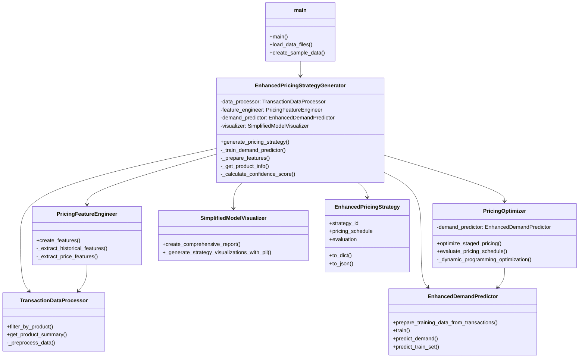
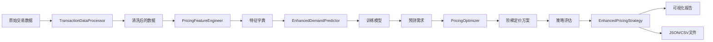

# 智能定价系统调用关系图（简化版）

## 主要调用路径

```
main.py:main()
│
├─ 1. 数据加载
│   ├─ load_data_files() → pd.read_csv()
│   └─ create_sample_data() → 生成示例数据
│
├─ 2. 系统初始化
│   ├─ ConfigManager() → 配置管理
│   └─ EnhancedPricingStrategyGenerator.__init__()
│       ├─ TransactionDataProcessor()
│       ├─ PricingFeatureEngineer()
│       ├─ EnhancedDemandPredictor()
│       └─ SimplifiedModelVisualizer()
│
└─ 3. 生成定价策略
    └─ strategy_generator.generate_pricing_strategy()
        │
        ├─ 3.1 获取商品信息
        │   └─ _get_product_info()
        │       ├─ data_processor.filter_by_product()
        │       ├─ data_processor.get_product_summary()
        │       ├─ _estimate_cost_price()
        │       ├─ _is_fresh_product()
        │       └─ _estimate_shelf_life()
        │
        ├─ 3.2 准备特征
        │   └─ _prepare_features()
        │       ├─ feature_engineer.create_features()
        │       │   ├─ _filter_store_products()
        │       │   ├─ _create_base_features()
        │       │   ├─ _extract_historical_features()
        │       │   ├─ _extract_price_features()
        │       │   ├─ _extract_weather_features()
        │       │   ├─ _extract_calendar_features()
        │       │   └─ _extract_product_features()
        │       ├─ data_processor.get_product_summary()
        │       └─ _extract_store_features()
        │
        ├─ 3.3 训练需求预测模型
        │   └─ _train_demand_predictor()
        │       ├─ demand_predictor.prepare_training_data_from_transactions()
        │       │   ├─ data_processor.filter_by_product()
        │       │   └─ data_processor.get_product_summary()
        │       ├─ demand_predictor.train()
        │       │   └─ 训练 XGBoost/其他模型
        │       ├─ demand_predictor.predict_train_set()
        │       ├─ _calculate_performance_metrics()
        │       │   ├─ mean_absolute_error()
        │       │   ├─ mean_squared_error()
        │       │   └─ r2_score()
        │       └─ visualizer.create_comprehensive_report()
        │
        ├─ 3.4 优化定价方案
        │   ├─ PricingOptimizer()
        │   └─ pricing_optimizer.optimize_staged_pricing()
        │       └─ _dynamic_programming_optimization()
        │           └─ demand_predictor.predict_demand()
        │               ├─ _create_complete_feature_vector()
        │               └─ _advanced_heuristic_prediction() [如果模型未训练]
        │
        ├─ 3.5 评估定价方案
        │   └─ pricing_optimizer.evaluate_pricing_schedule()
        │       └─ _generate_recommendation()
        │
        ├─ 3.6 计算置信度
        │   └─ _calculate_confidence_score()
        │
        ├─ 3.7 生成可视化
        │   └─ visualizer._generate_strategy_visualizations_with_pil()
        │
        └─ 3.8 创建策略对象
            └─ EnhancedPricingStrategy()
│
└─ 4. 保存和导出
    ├─ strategy_generator.save_strategy()
    │   └─ strategy.to_json()
    └─ 导出执行计划CSV
```

## 类图关系



## 数据流图



## 关键方法调用统计

| 模块 | 主要方法 | 被调用次数 |
|------|---------|-----------|
| EnhancedPricingStrategyGenerator | generate_pricing_strategy | 1 (主入口) |
| | _get_product_info | 多次 (缓存) |
| | _prepare_features | 1 |
| | _train_demand_predictor | 1 (缓存) |
| TransactionDataProcessor | filter_by_product | 多次 |
| | get_product_summary | 多次 |
| PricingFeatureEngineer | create_features | 1 |
| EnhancedDemandPredictor | predict_demand | 多次 (优化循环中) |
| | train | 1 (缓存) |
| PricingOptimizer | optimize_staged_pricing | 1 |
| | evaluate_pricing_schedule | 1 |

## 缓存机制

- **商品信息缓存**: `_product_cache` - 避免重复计算商品信息
- **模型缓存**: `_model_cache` - 避免重复训练相同商品的模型
- **训练历史缓存**: `_training_history` - 保存训练结果
- **策略缓存**: `_strategy_cache` - 保存生成的策略

## 性能优化点

1. **LRU缓存**: `_get_product_info_cached` 使用 `@lru_cache`
2. **模型复用**: 相同商品和门店的模型只训练一次
3. **数据预处理**: 数据在初始化时预处理，避免重复处理
4. **特征缓存**: 特征工程结果可复用


